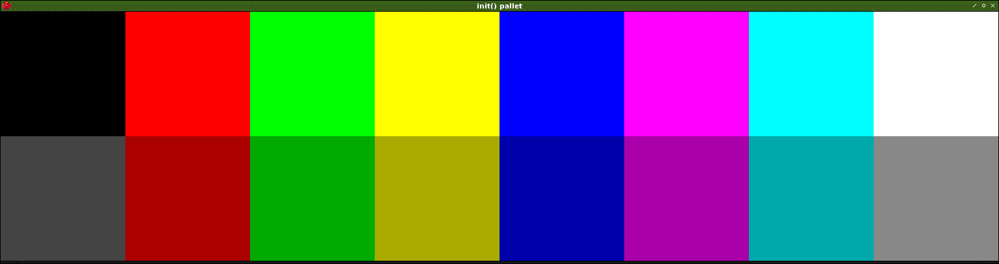

[en](./README.md)

# Pyxel.init.pallet

　パレット色を設定する。

# デモ



# 開発環境

* <time datetime="2020-04-04T12:56:38+0900">2020-04-04</time>
* [Raspbierry Pi](https://ja.wikipedia.org/wiki/Raspberry_Pi) 4 Model B Rev 1.2
* [Raspbian](https://ja.wikipedia.org/wiki/Raspbian) buster 10.0 2019-09-26 <small>[setup](http://ytyaru.hatenablog.com/entry/2019/12/25/222222)</small>
* bash 5.0.3(1)-release
* Python 3.7.3
* [pyxel][] 1.3.1

[pyxel]:https://github.com/kitao/pyxel

```sh
$ uname -a
Linux raspberrypi 4.19.97-v7l+ #1294 SMP Thu Jan 30 13:21:14 GMT 2020 armv7l GNU/Linux
```

# インストール

　3.7以上のPythonをインストールする。

　次に以下のように[pyxel][]をインストールする。

* [pyxel/README](https://github.com/kitao/pyxel/blob/master/README.ja.md#%E3%82%A4%E3%83%B3%E3%82%B9%E3%83%88%E3%83%BC%E3%83%AB%E6%96%B9%E6%B3%95)

```sh
sudo apt install python3 python3-pip libsdl2-dev libsdl2-image-dev
git clone https://github.com/kitao/pyxel.git
cd pyxel
make -C pyxel/core clean all
pip3 install .
```

# 使い方

```sh
git clone https://github.com/ytyaru/Python.Pyxel.init.pallet.20200404125657
cd Python.Pyxel.init.pallet.20200404125657/src
./run.sh
```

# 著者

　ytyaru

* [](https://github.com/ytyaru "github")
* [](http://ytyaru.hatenablog.com/ytyaru "hatena")
* [](https://mstdn.jp/web/accounts/233143 "mastdon")

# ライセンス

　このソフトウェアはCC0ライセンスである。

[](http://creativecommons.org/publicdomain/zero/1.0/deed.ja)

